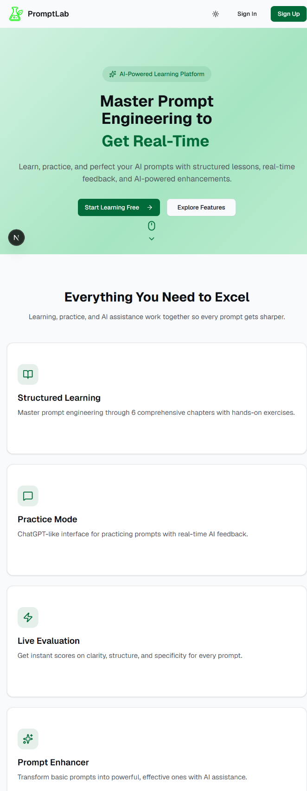
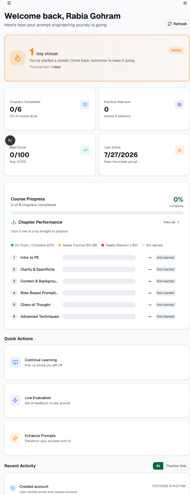
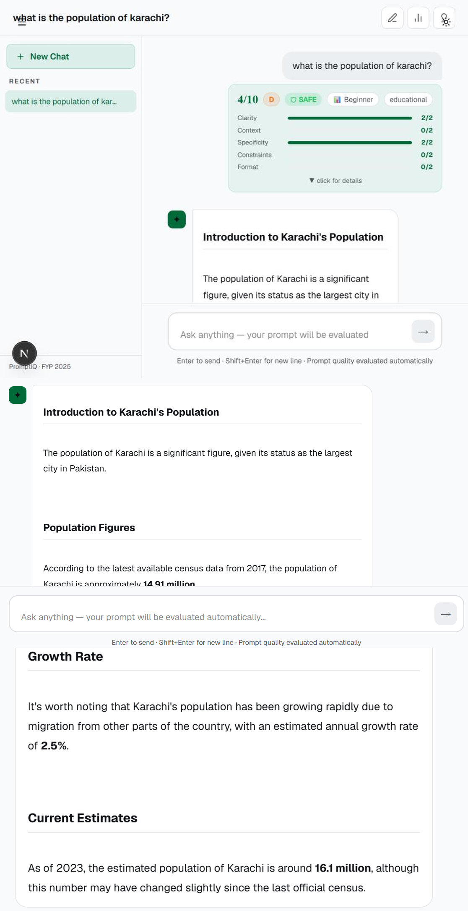

# PromptLab

**AI-powered prompt engineering learning and evaluation platform developed as a Final Year Project (FYP-1), 2026.**

PromptLab is a web application designed to help users learn and practice prompt engineering. It provides structured learning content, prompt-writing practice, AI-based evaluation and feedback, prompt enhancement, chat functionality, and progress tracking.

> **Project Type:** University Final Year Project — Team of 4
> **My Role:** FYP Lead — Backend, Authentication, Database Integration & User Dashboard

This repository is my personal GitHub copy of the team's PromptLab project. The project was developed collaboratively, and the team contributions are documented below.

---

## Screenshots

### Landing Page



### User Dashboard



### Live Prompt Evaluation



### Prompt Enhancement


---

## My Contribution

As the **FYP Lead**, I worked primarily on the application's user management, authentication, backend integration, database functionality, and dashboard experience.

### Backend & Authentication

* Developed the authentication and user-management backend
* Implemented user registration and login
* Implemented email/OTP verification
* Implemented password reset functionality
* Implemented session-based authentication and logout
* Added authentication-related API endpoints
* Integrated SQLite for local application data

### Dashboard & User Data

* Developed the user dashboard
* Implemented user statistics and progress tracking
* Implemented streak tracking
* Implemented prompt history and activity tracking
* Developed APIs for dashboard, history, and user activity data

### Frontend & Integration

* Worked on the landing page and dashboard interface
* Connected frontend screens with backend APIs
* Integrated authentication flows with the frontend
* Tested and integrated the different project modules

---

## Team Contributions

PromptLab was developed collaboratively by four team members.

| Member            | Main Responsibility                                                        |
| ----------------- | -------------------------------------------------------------------------- |
| **Areeba Sarwar** | User management, authentication, dashboard, backend & database integration |
| **Fatima**        | Learning module, practice sessions, evaluation, final test & certificates  |
| **Laiba**         | Prompt evaluation, chat, analytics & multi-agent review                    |
| **Rabia**         | Prompt enhancer, quick answers & enhancement history                       |

---

## Features

### Learning & Practice

* Structured prompt engineering learning chapters
* Prompt-writing practice sessions
* AI-generated practice feedback
* Scores, strengths, weaknesses, and suggestions
* Final certification test
* Certificate of completion

### Prompt Evaluation

* Prompt quality evaluation
* Evaluation based on clarity, context, specificity, constraints, and format
* Multi-agent review using different evaluation perspectives
* Prompt security scanning
* Detection of prompt injection, jailbreak, and unsafe prompt patterns
* Prompt difficulty classification

### Prompt Enhancement

* AI-powered prompt improvement
* Prompt mutation tools
* Enhanced prompt generation
* Enhancement history

### User & Application Features

* User registration and login
* Email/OTP verification
* Password reset
* Session-based authentication
* User dashboard
* Progress and streak tracking
* Activity history
* Prompt history
* Chat functionality
* SQLite-backed local persistence

---

## Tech Stack

| Layer                  | Technologies                                       |
| ---------------------- | -------------------------------------------------- |
| **Frontend**           | Next.js, React, TypeScript, Tailwind CSS, Radix UI |
| **Backend**            | Python, Flask, Flask-CORS                          |
| **Database**           | SQLite                                             |
| **AI**                 | Groq API, Llama 3.3 70B                            |
| **Package Management** | pnpm                                               |

---

## Architecture

PromptLab uses a modular frontend/backend architecture.

```text
                    ┌─────────────────────┐
                    │      Next.js        │
                    │      Frontend       │
                    └──────────┬──────────┘
                               │
                               ▼
                    ┌─────────────────────┐
                    │    API Gateway      │
                    │      Port 8000      │
                    └──────────┬──────────┘
                               │
          ┌────────────────────┼────────────────────┐
          │                    │                    │
          ▼                    ▼                    ▼
   ┌─────────────┐      ┌─────────────┐      ┌─────────────┐
   │ Areeba API  │      │ Fatima API  │      │  Laiba API  │
   │   :5001     │      │   :5002     │      │   :5000     │
   └─────────────┘      └─────────────┘      └─────────────┘
          │
          ▼
   ┌─────────────┐
   │  Rabia API  │
   │   :5003     │
   └─────────────┘
```

The application can also be run using the combined backend for development and API testing.

---

## Project Structure

```text
PromptLab/
│
├── Backend/
│   ├── main.py
│   ├── run_all.py
│   ├── gateway.py
│   ├── requirements.txt
│   │
│   ├── Areeba/
│   │   └── app.py
│   │
│   ├── Fatima/
│   │   └── app.py
│   │
│   ├── Laiba/
│   │   └── app.py
│   │
│   └── Rabia/
│       └── app.py
│
├── Frontend/
│   ├── app/
│   ├── components/
│   ├── contexts/
│   ├── package.json
│   └── pnpm-lock.yaml
│
├── screenshots/
│   ├── 01_landing_page_light.png
│   ├── 12_dashboard_initial.png
│   ├── 19_live_evaluation_screen.png
│   └── 21_prompt_enhancement_enhanced_result.png
│
├── .gitignore
└── README.md
```

---

## Prerequisites

Before running PromptLab, install:

* Python 3.10+
* Node.js 20+
* pnpm
* A Groq API key

---

## Environment Variables

### Backend

Create a file named `.env` inside `Backend/`:

```env
GROQ_API_KEY=your_groq_api_key_here
GROQ_MODEL=llama-3.3-70b-versatile
```

Optional backend variables:

```env
SMTP_HOST=smtp.gmail.com
SMTP_PORT=587
SMTP_USER=your_email@example.com
SMTP_PASSWORD=your_email_app_password

AREEBA_API=http://127.0.0.1:5001
FATIMA_DB_PATH=fatima_learning.db

RABIA_DB_PATH=rabia_enhancer.db
RABIA_PORT=5003
RABIA_USE_GROQ=false

FLASK_DEBUG=false
PRACTICE_PASSING_SCORE=70
```

### Frontend

Create `.env.local` inside `Frontend/`:

```env
NEXT_PUBLIC_AREEBA_API=http://127.0.0.1:5001
NEXT_PUBLIC_FATIMA_API=http://127.0.0.1:5002
NEXT_PUBLIC_LAIBA_API=http://localhost:5000
NEXT_PUBLIC_RABIA_API=http://127.0.0.1:5003
```

> **Important:** Do not commit API keys, passwords, `.env` files, `.env.local` files, or local database files.

---

## Backend Setup

From the `Backend` directory:

```bash
cd Backend
python -m venv venv
```

### Windows

```powershell
venv\Scripts\activate
```

### Install dependencies

```bash
pip install -r requirements.txt
```

---

## Frontend Setup

From the `Frontend` directory:

```bash
cd Frontend
pnpm install
```

If pnpm is not installed, npm can also be used:

```bash
npm install
```

---

## Running the Project

For the complete application experience, run the separate backend services.

### Terminal 1 — Backend

```powershell
cd Backend
venv\Scripts\activate
python run_all.py
```

The services run on:

| Service               | URL                     |
| --------------------- | ----------------------- |
| Areeba Authentication | `http://127.0.0.1:5001` |
| Fatima Learning       | `http://127.0.0.1:5002` |
| Laiba Evaluation      | `http://localhost:5000` |
| Rabia Enhancement     | `http://127.0.0.1:5003` |
| API Gateway           | `http://127.0.0.1:8000` |

### Terminal 2 — Frontend

```powershell
cd Frontend
pnpm run dev
```

Then open:

```text
http://localhost:3000
```

---

## Single Backend Mode

For development or API testing, the combined backend can also be started directly:

```powershell
cd Backend
venv\Scripts\activate
python main.py
```

This starts the combined Flask backend on:

```text
http://localhost:5000
```

Some frontend screens expect the separate services on ports `5001`, `5002`, and `5003`, so `run_all.py` is recommended for the complete application.

---

## API Overview

### General

| Method | Endpoint      | Description          |
| ------ | ------------- | -------------------- |
| GET    | `/api/health` | Backend health check |

### Areeba — Authentication & Dashboard

| Method | Endpoint                               | Description                         |
| ------ | -------------------------------------- | ----------------------------------- |
| POST   | `/api/areeba/register`                 | Register a new user                 |
| POST   | `/api/areeba/verify-registration`      | Verify registration code            |
| POST   | `/api/areeba/resend-registration-code` | Resend verification code            |
| POST   | `/api/areeba/login`                    | User login                          |
| GET    | `/api/areeba/me`                       | Get current user                    |
| POST   | `/api/areeba/logout`                   | User logout                         |
| POST   | `/api/areeba/forgot-password`          | Request password reset              |
| POST   | `/api/areeba/reset-password`           | Reset password                      |
| GET    | `/api/areeba/dashboard/me`             | Get current user's dashboard        |
| GET    | `/api/areeba/dashboard/<user_id>`      | Get dashboard by user ID            |
| GET    | `/api/areeba/streak/me`                | Get current user streak             |
| GET    | `/api/areeba/history`                  | Get current user's activity/history |

### Other Modules

The remaining API endpoints support:

* Learning chapters and practice sessions
* Certification tests and certificates
* Prompt evaluation
* Multi-agent prompt review
* AI chat
* Prompt enhancement
* Prompt history
* Analytics
* Security scanning
* Prompt difficulty classification

---

## Useful Commands

### Check Git status

```bash
git status
```

### Add changes

```bash
git add .
```

### Commit changes

```bash
git commit -m "Update README and screenshots"
```

### Push to GitHub

```bash
git push
```

---

## Project Status

PromptLab was developed as a university FYP-1 project in 2026.

The project demonstrates the integration of:

* AI-powered prompt evaluation
* Prompt enhancement
* User authentication
* Backend API development
* Database integration
* Frontend/backend integration
* User progress tracking
* Modular application architecture

---

## Team

**Areeba Sarwar** — FYP Lead
**Fatima** — Learning Module
**Laiba** — Evaluation & Chat
**Rabia** — Prompt Enhancement

---

## Repository

This repository contains my personal GitHub copy of the collaboratively developed PromptLab project, with my individual contributions documented above.
